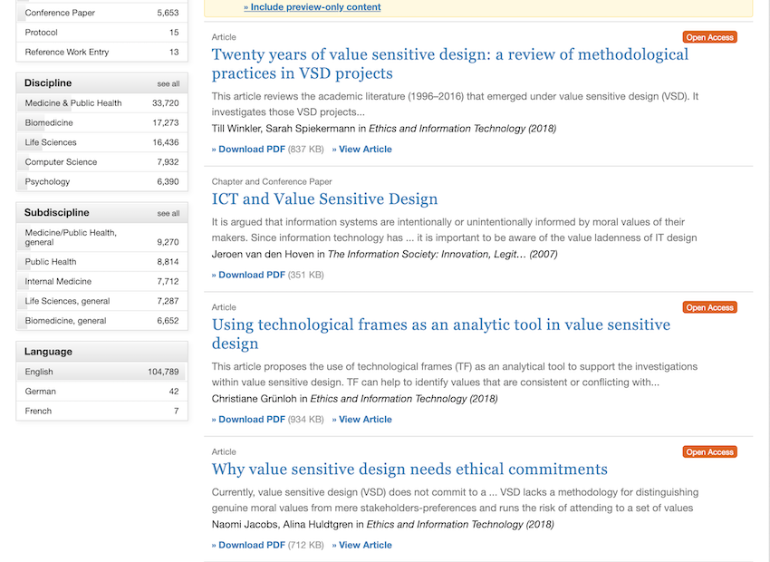

# MANIFESTO DEL C'HI++

Questo è un tentativo, forse un po' naïf, ma molto ben strutturato, di cambiare il Mondo.
In meglio, auspicabilmente.

Per cambiare il Mondo non servono né canzoni, né guerre, né rivoluzioni, ma delle divinità meno irriconoscenti di quelle, prettamente terrene, davanti alle quali ci prostriamo oggi: Denaro, Successo, Fama.

## Abbiamo bisogno di un'etica
Ne abbiamo bisogno noi e ne hanno bisogno anche i sistemi a cui presto dovremo affidare la nostra sicurezza: *smart-house*, *smart-car*, *robot*.
Il problema è che *etica*, così come *amore* e *arte*, è un termine che tutti utilizzano ma che ciascuno può - legittimamente - interpretare a modo suo.

Di fatto, l’etica è una disciplina filosofica, ma per estensione è anche l’oggetto di studio di quella disciplina: uno schema di valori e di regole che permettono di decidere cosa sia più o meno giusto fare.
In altre parole, comprensibili anche agli adoratori del dio Ferragnez, l'etica è il *dress-code* delle nostre vite e come tutti i *dress-code*, **una determinata etica ha valore solo in determinate condizioni**.
Ciò che è eticamente accettabile in alcuni casi, può non esserlo in altri.
Per esempio, uccidere un avversario perché indossa “una divisa di un altro colore” è ammissibile in guerra, ma non durante una partita di calcio.

Inoltre, **i valori che costituiscono un'etica sono soggettivi**.

La *United States Declaration of Independence* del 1776 comincia con l'affermazione:

> We hold these truths to be self-evident, that all men are created equal, that they are endowed by their Creator with certain unalienable Rights, that among these are Life, Liberty and the pursuit of Happiness.

Definire un principio: *self-evident* equivale a dichiarare un dogma: una convinzione che appartiene a chi scrive, ma non si applica necessariamente a tutti gli esseri viventi.
È stata necessaria una guerra civile per far accettare agli Stati del Sud l’idea che gli schiavi africani erano esseri umani e dovevano dunque godere della libertà; sono dovuti passare 188 anni, fino al Giugno del 1964, per ammettere che la segregazione razziale era in conflitto con questo principio.

Il primo Articolo della *Déclaration des Droits de l’Homme et du Citoyen* del 1798 non ha le contaminazioni fideistiche della Dichiarazione americana, ma la frase:

> Les hommes naissent et demeurent libres et égaux en droits. Les distinctions sociales ne peuvent être fondées que sur l’utilité commune.

pur se condivisibile, non ha prove a conforto e non è valida per chiunque viva in una delle 43 nazioni del Mondo dove vige una monarchia: ovvero una su cinque.

La contraddittoria<a href="#harari" class="nota" name="fn-1"><sup>1</sup></a> trinità:

> Liberté, Égalité, Fraternité

è dogmatica così come:

> Dio, Patria, Famiglia

Nulla prova che questi valori siano reali, corretti o immutabili, anzi: il fatto stesso che si debba coniare un motto per propugnare un'idea significa che quel concetto è accessorio e che serve un'opera di convincimento per farlo accettare globalmente.
Buona parte dei princip&icirc; e dei concetti che regolano le nostre vite sono frutto della nostra immaginazione (il che non vuol dire che siano falsi).
Crediamo in essi non perché siano veri ed evidenti, ma perché qualcosa o qualcuno ci ha convinto a farlo.  
Se consideriamo la notevole disparità di vedute e convinzioni dei Popoli della Terra e, talvolta, degli stessi individui all'interno di un Popolo, è facile capire come la frase:

> AI interactions that consumers and citizens perceive as ethical build trust and satisfaction<a href="#cap" class="nota" name="fn-2"><sup>2</sup></a>

sia ambigua perché ciò che è *percepito* come “ethical” da qualcuno potrebbe non esserlo per altri.

La conseguenza di questa indeterminatezza è che, come dimostrano il primo e l'ultimo articolo di [Springer](https://rd.springer.com) nell'immagine qui sotto , da vent'anni si sta lavorando a del software “sensibile ai valori”, ma ancora non si è riuscito a decidere **quali** debbano essere questi valori.

<p></p>

Mancando un'etica *pret-a-porter*, siamo costretti a ordinarne una fatta su misura.

## Differenti tipi di etica
Le eiche possono essere o di natura religiosa o di natura non religiosa.
Quale tipo conviene scegliere?

**Le etiche religiose** hanno il difetto di basarsi su principî e affermazioni che non possono in acun modo essere dimostrati (p.es. esistono una o più Divinità; hanno determinate caratteristiche; esigono che ci comportiamo in una determinata maniera ecc.).
Questi principî si suppongono universali e immutabili; quando qualcosa li modifica, si verificano delle divisioni fra i fedeli che causano scontri spesso cruenti (p.es. Cattolici vs. Valdesi, Sunniti vs. Sciiti, Mahāyāna vs. Kamalaśīla);
Un altro problema da considerare, quando si valuta l'adozione di etiche religiose, è che chi le predica agisce talvolta in un modo che va contro gli ideali professati.

**Le etiche non religiose**, di contro, hanno il difetto di basarsi su principî e affermazioni che non trovano riscontro nella realtà (p.es. *Liberté, Égalité, Fraternité* ecc.).
Questi principî, che si suppongono universali e immutabili, variano solo in seguito a guerre o crisi sociali spesso cruente (p.es. Luigi XVI vs. Sanculotti, Lincoln vs. Davis, Segregazionisti vs. Mandela ecc.).
Un altro problema da considerare, quando si valuta l'adozione di etiche laiche, è che chi le predica agisce molto spesso in un modo che va contro gli ideali professati.

Se le differenze finissero qui, scegliere l'una o l'altra possibilità non farebbe una grossa differenza, ma sfortunatamente **le filosofie di origine laica** hanno un'altro difetto: negando ogni forma di trascendenza, **devono ricercare le motivazioni del proprio schema di valori all'interno dello schema stesso**; un'azione del tutto lecita, ma che le rende meno solide degli schemi di valori basati su convinzioni religiose.

Per fare un paragone che sia comprensibile anche agli adoratori del dio Ronaldo, i religiosi sono calciatori che giocano all'interno di un regolare Campionato, con premio finale al vincitore e punizioni per chi si comporta in modo scorretto; i laici, invece, sono calciatori che giocano lo stesso numero di partite, ma senza premio finale e senza squalifiche per gioco falloso.
È facile intuire come sia più difficile per questi ultimi, mancando sia le ricompense che le punizioni, mantenere un comportamento corretto sul campo da gioco.
Se la partita è fine a sé stessa e l'unica cosa importante è vincere, non c'è ragione di comportarsi bene.
Per alcuni, non c'è nemmeno ragione di continuare a giocare.

## La Banda degli Onesti
Stabilito che **abbiamo bisogno di nuovi valori etici che possano ricollegarsi a una qualche convinzione spirituale**, ci restano da risolvere alcuni problemi.

Il primo è decidere a quale spiritualità fare riferimento.
Ovviamente non potrà essere una delle religioni canoniche, perché così facendo allontaneremmo gli appartenenti alle altre Fedi.
Dovrà essere una nuova filosofia di vita che contrasti il meno possibile con le convinzioni degli altri gruppi religiosi.
Inoltre sarà bene non definirla *religione*, perché molte persone hanno un'istintiva (e non del tutto immotivata) diffidenza nei confronti di questo termine perché le attribuiscono colpe che in realtà andrebbero imputate al clero e ai fedeli e vedono il *religare* da cui trae origine come un legame restrittivo da cui è bene sottrarsi.
La chiameremo perciò: *Metafisica* per non rischiare di allontanare..

> quei tanti che ancora credono in tutto ciò in cui più nessuno crede

come li descrisse Longanesi; quella *Banda degli Onesti* che tutti i giorni fa il proprio dovere al meglio possibile anche quando non gli conviene.

Per riprendere il paragone calcistico fatto prima, C'hi++ non cercherà calciatori negli altri campionati.
Chi ha la Fede non ha bisogno di conferme razionali; possono compiacerlo, ma non gli sono necessarie, perché i precetti del suo Credo gli insegnano ciò che è giusto e ciò che non è giusto fare.

C'hi++, però, può dare forza a quei calciatori che non si arrendono e continuano a giocare rispettando le regole anche se tutti intorno a loro - pubblico, arbitro, guardalinee e perfino i loro compagni - li istigano a compiere delle scorrettezze.
Può aiutarli a non arrendersi e può insegnare loro che non è importante vincere le partite, ma giocare sempre meglio.
Riconoscere gli sbagli che si sono fatti, imparare da essi e cercare di non ripeterli più, partita dopo partita, in una ricerca continua del meglio.
Se si comporteranno così, qualunque sarà il loro lavoro, fosse anche pulire i cessi, sarà comunque Arte.

## Si può fare!
Riassumendo, abbiamo bisogno di una nuova etica che:

- proponga valori alternativi a quelli in voga attualmente;
- si basi su una nuova forma di spiritualità compatibile  quelle già esistenti;
- sarà bene definire *Metafisica*, anche se avrà ben pochi aspetti metafisici.

Come avete letto qui sopra, si può fare, ma per riuscirci dobbiamo rifarci alle idee che nacquero e si svilupparono nella Culla della Civiltà, ovvero gli anni '80.

Per definire un *dress-code* etico che sia valido tanto a una cena di gala che a un toga party dobbiamo fare ciò che fecero i creatori delle prime interfacce grafiche: creare una libreria di simboli il cui significato sia chiaro e condiviso da tutti gli utenti.
In sostanza, **abbiamo bisogno di icone**.

Il sostantivo inglese *file* può tradursi con: documento, ملف (Arabo), 文件 (Cinese), файл (Russo), ファイル (Giapponese), 파일 (Coreano) oppure, più semplicemente, può essere rappresentato con il simbolo:

<p align=center></p>

Così come la pipa di Magritte, il documento del simbolo **non è un documento**, ma questo non ha importanza perché ciò che conta, qui, è il significato, non il significante.
Quando l'utente di un sistema di scrittura vede il simbolo *File*, non pensa né che quel documento **sia** quello che vuole scrivere lui né che **non sia** il documento che vuole scrivere lui.
È questo l'atteggiamento che dobbiamo stimolare nei fruitori della nostra etica.
Per riuscirci, dobbiamo operare come i poeti o i disegnatori di fumetti, eliminando dai nostri simboli tutto ciò che è superfluo e lasciando solo ciò che serve a denotare l'oggetto a cui si riferiscono.

<p align=center></p>

Pur se complesso, tutto questo è possibile. 
Spogliate degli orpelli e ricondotte alle loro caratteristiche essenziali, le diverse ipotesi metafisiche hanno molti punti in comune perché sono tutte, in una maniera o nell'altra, la risposta a uno stesso bisogno: la ricerca di una giustificazione alla nostra esistenza.

Posso dirlo con buona certezza, perché **C’hi++ – Il senso della vita è il debug** è precisamente questo: una metafisica a basso contenuto di elementi metafisici, sui cui principii è possibile basare un’etica *open-source* che è, allo stesso tempo, altamente compatibile con le principali religioni canoniche, ma allo stesso tempo, indipendente da ciascuna di esse.

Così come il nome *C'hi++* unisce il termine giapponese *C'hi* (氣, ovvero: *soffio vitale*) e l'operatore `++` tipico dei linguaggi di programmazione, il libro è, allo stesso tempo, un manuale di programmazione nel linguaggio *C++* e un libro di filosofia.
Non è un accostamento così anomalo: così come le religioni definiscono i rapporto fra l'uomo e la (o *le*) divinità, i linguaggi di programmazione definiscono il modo in cui i programmi si rapportano al sistema operativo e molto spesso i principii che valgono in un àmbito possono essere utilizzati, quanto meno come esempio, anche nell'altro.  
Il caricamento di dati e programmi nella memoria RAM del computer, per esempio, è la trasposizione informatica del Ciclo delle Rinascite delle religioni orientali, mentre i concetti aristotelici di *universale* e *sostanza* sono applicabili anche alle *classi* del C++.

Ho cominciato a elaborare questa teoria nel 2005. 
Nel 2009 ho scritto il [Prologo](https://chiplusplus.org/man/prologo) e i primi due capitoli libro, ma una serie di spiacevoli eventi personali ne ha rallentato la redazione fino al 2018, quando misi tutti i documenti che avevo elaborato fino ad allora su GitHub e feci un primo tentativo di formalizzare la mia dottrina nella [**Proposta per una metafisica open-source**](https://chiplusplus.org/proposta.html).  
Preso atto della mia incapacità di produrre un documento accademico, redassi la *Proposta* come se fosse un progetto informatico, con un *Executive Summary* e un' *Analisi del sistema attualmente in esercizio* nel quale descrivevo il problema che mi proponevo di affrontare ed esaminavo le sue  possibili soluzioni.  

Nel 2020, all'inizio del primo *lockdown*, decisi di mettere in atto quanto suggeriva su Facebook il professor Floridi e, come Newton, approfittai della reclusione coatta per dedicarmi al Manuale, che completai, nella sua prima stesura, a Settembre 2021:

```
* |   commit 3c959429331ef385cc3bc46df62229ba2aafac3b
|\ \  Merge: 2969424 164117e
| | | Author: Chi++ <git@chiplusplus.net>
| | | Date:   Sat Sep 25 15:35:03 2021 +0200
| | | 
| | |     Merge branch 'capitolo/polimorfismo' into redazione
| | | 
| * | commit 164117e827294b08a2bf79fdfd5d8d4b3e8ff948
|/ /  Author: Chi++ <git@chiplusplus.net>
| |   Date:   Sat Sep 25 15:34:23 2021 +0200
| |   
| |       Completata prima stesura del capitolo sul polimorfismo
| | 
```

Se volete sapere qualcosa di più sul *C'hi++*, il testo del manuale è all'indirizzo: <a href="https://chiplusplus.org" target="chi" >chiplusplus.org</a>. 
Se non avete o tempo o voglia di leggerlo tutto (probabile), leggete almeno <a href="https://chiplusplus.org/man/memoria#delete" target="chi" >questo brano del capitolo sulla memoria</a>.

Se volete collaborare o anche esporre delle critiche, potere farlo con gli strumenti canonici di GitHub.

<section class="note">
    <h2>Note</h2>
    <ol>
    <li>
        “Fin dalla Rivoluzione francese, in ogni parte del mondo si è arrivati gradualmente a considerare valori universali sia l’eguaglianza sia la libertà individuale. Tali valori, però, si contraddicono a vicenda. L’eguaglianza può essere assicurata solo decurtando le libertà di coloro che stanno meglio.” - Harari, Yuval Noah. <i>Sapiens. Da animali a dèi: Breve storia dell'umanità</i>. Bompiani, 2019. 
        <a href="#fn-1" name="harari">&#8617;</a>
    </li>
    <li>
        Rapporto Capgemini: <i>Why addressing ethical questions in AI will benefit organizations</i>.
        <a target="note"
            href="https://www.capgemini.com/research/why-addressing-ethical-questions-in-ai-will-benefit-organizations/">
            <i>www.capgemini.com/research/why-addressing-ethical-questions-in-ai-will-benefit-organizations </i></a>
        <a href="#fn-2" name="cap">&#8617;</a>
    </li>
    <li>
</section>
