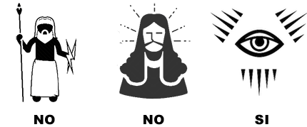

# MANIFESTO DEL C'HI++

Questo è un tentativo, forse un po' naïf, ma molto ben strutturato, di cambiare il Mondo.
In meglio, auspicabilmente.

Per cambiare il Mondo non servono né canzoni, né guerre, né rivoluzioni, ma delle divinità meno irriconoscenti di quelle - prettamente terrene - davanti alle quali ci prostriamo oggi: denaro, successo, fama.  
In sostanza: abbiamo bisogno di una nuova etica.

## Abbiamo bisogno di un'etica
Ne abbiamo bisogno noi e ne hanno bisogno anche i sistemi a cui presto dovremo affidare la nostra sicurezza: *smart-house*, *smart-car*, *robot*.
Il problema è che *etica*, così come *amore* e *arte*, è un termine che tutti utilizzano ma che ciascuno può - legittimamente - interpretare a modo suo.

L'etica è una disciplina filosofica e, per estensione, l'oggetto di studio di quella disciplina: uno schema ordinato di valori e di regole che permettono di determinare cosa sia più o meno giusto fare.
Un esempio di questi insiemi ordinati di valori è la trinità fascista:

> Dio, Patria, Famiglia

Le regole che se ne possono derivare sono:

> Credere, Obbedire, Combattere

Il motto della Repubblica Francese è anch'esso uno schema di valori, ma libero da connotazioni religiose:

> Liberté, Égalité, Fraternité

In altre parole, comprensibili anche agli adoratori del dio Ferragnez, l'etica è il *dress-code* delle nostre vite e come tutti i *dress-code*, ha valore solo in determinate condizioni.
Ciò che è *eticamente* accettabile in alcuni casi (p.es. uccidere un avversario perché indossa una *divisa di un altro colore*, in guerra) può non esserlo in altre contingenze (p.es. uccidere un avversario perché indossa una divisa di un altro colore, durante una partita di calcio).

Inoltre, sia i valori che costituiscono un'etica sia il loro eventuale ordinamento sono soggettivi: non esiste alcuna prova né dell'esistenza di un Dio né del fatto che sia più importante di Patria e Famiglia; ci devi credere, e ci credi perché qualcosa o qualcuno ti ha convinto a farlo.
Se consideriamo la notevole disparità di vedute e convinzioni dei Popoli della Terra e, talvolta, degli stessi individui all'interno di un Popolo, è facile capire come la frase:

> AI interactions that consumers and citizens perceive as ethical build trust and satisfaction<a href="#capgemini">1</a>

sia ambigua perché ciò che è percepito come *etico* da qualcuno potrebbe non esserlo per altri.

La conseguenza di questa indeterminatezza ce la illustrano il primo e l'ultimo degli articoli di [Springer](rd.springer.com) che vedete qui sotto: da vent'anni si sta lavorando a del software “sensibile ai valori”, ma ancora non si è riuscito né a decidere quali debbano essere questi valori né come fare per distinguerli dalle *mere stake-holders preferences*.

Mancando un'etica *pret-a-porter*, siamo costretti a ordinarne una fatta su misura.

## Differenti tipi di etica
I principali produttori di etica, al Mondo, sono i religiosi e i laici<a href="#laici">2</a>.
Quale tipo conviene scegliere?

**Le etiche religiose** hanno il difetto di basarsi su principî e affermazioni che non possono in acun modo essere dimostrati (p.es. esistono una o più Divinità; hanno determinate caratteristiche; esigono che ci comportiamo in una determinata maniera ecc.).
Questi principî si suppongono universali e immutabili; quando qualcosa li modifica, si verificano delle divisioni fra i fedeli che causano scontri spesso cruenti (p.es. Cattolici vs. Valdesi, Sunniti vs. Sciiti, Mahāyāna vs. Kamalaśīla);
Un altro problema da considerare, quando si valuta l'adozione di etiche religiose, è che chi le predica, talvolta, agisce in un modo che va contro gli ideali professati.

**Le etiche di origine laica**, di contro, hanno il difetto di basarsi su principî e affermazioni che non trovano riscontro nella realtà (p.es. *Liberté, Égalité, Fraternité* ecc.).
Questi principî, che si suppongono universali e immutabili, variano solo in seguito a guerre o crisi sociali spesso cruente (p.es. Luigi XVI vs. Sanculotti, Lincoln vs. Davis, Segregazionisti vs. Mandela ecc.).
Un altro problema da considerare, quando si valuta l'adozione di etiche laiche, è che chi le predica agisce molto spesso in un modo che va contro gli ideali professati.

Se le differenze finissero qui, scegliere l'una o l'altra possibilità non farebbe una grossa differenza, ma sfortunatamente le filosofie di origine laica hanno un'altro difetto: negando ogni forma di trascendenza, **devono ricercare le motivazioni del proprio schema di valori all'interno dello schema stesso**; un'azione del tutto lecita, ma che le rende meno solide degli schemi di valori basati su convinzioni religiose.

Per fare un paragone che sia comprensibile anche agli adoratori del dio Ronaldo, i religiosi sono calciatori che giocano all'interno di un regolare Campionato, con premio finale al vincitore e punizioni per chi si comporta in modo scorretto; i laici, invece, sono calciatori che giocano lo stesso numero di partite, ma senza premio finale e senza squalifiche per gioco falloso.
È facile intuire come sia più difficile per questi ultimi, mancando sia le ricompense che le punizioni, mantenere un comportamento corretto sul campo da gioco.
Se la partita è fine a sé stessa e l'unica cosa importante è vincere, non c'è ragione di comportarsi bene.
Per alcuni, non c'è nemmeno ragione di continuare a giocare.

## La Banda degli Onesti
Stabilito che è meglio adottare dei valori che possono ricollegarsi a una qualche convinzione spirituale, ci restano da risolvere alcuni problemi.

Il primo è decidere a quale spiritualità fare riferimento.
Ovviamente non potrà essere una delle religioni canoniche, perché così facendo allontaneremmo gli appartenenti alle altre Fedi.
Dovrà essere una nuova filosofia di vita che contrasti il meno possibile con le convinzioni degli altri gruppi religiosi.
Inoltre sarà bene non definirla *religione*, perché molte persone hanno un'istintiva (e non del tutto immotivata) diffidenza nei confronti di questo termine e vedono il *religare* da cui trae origine come un legame restrittivo da cui è bene sottrarsi.
La chiameremo perciò: *Metafisica*, anche se di metafisico avrà ben poco, per non correre il rischio di allontanare proprio le persone a cui è destinato il C'hi++, quella *Banda degli Onesti* che tutti i giorni fa il proprio dovere al meglio possibile anche se non gli conviene, anche se gli arreca danno.

Per riprendere il paragone calcistico fatto prima, C'hi++ non cercherà calciatori negli altri campionati.
Chi ha la Fede non ha bisogno di conferme razionali; possono compiacerlo, ma non gli sono necessarie.
I precetti del loro Credo dicono loro ciò che è giusto e ciò che non è giusto fare.

C'hi++, però, può dare forza a quei calciatori che non si arrendono e continuano a giocare rispettando le regole anche se tutti intorno a loro - pubblico, arbitro, guardalinee e perfino i loro compagni - li istigano a compiere delle scorrettezze.
Può aiutarli a non arrendersi, perché fino a quando loro non si arrenderanno, ci sarà speranza e può insegnare loro che non è importante vincere le partite, ma giocare sempre meglio.
Riconoscere gli sbagli che si sono fatti, imparare da essi e cercare di non ripeterli più, partita dopo partita, in una ricerca continua del meglio.
Se si comporteranno così, qualunque sarà il loro lavoro, fosse anche pulire i cessi, sarà comunque Arte.

## Si può fare!
Riassumendo, abbiamo bisogno di una nuova etica che proponga valori alternativi a quelli in voga attualmente, che si basi su una nuova forma di spiritualità compatibile  quelle già esistenti e che sarà bene definire *Metafisica*, anche se non avrà aspetti metafisici.
Si può fare, ma per riuscirci dobbiamo rifarci alle idee che nacquero e si svilupparono nella Culla della Civiltà, ovvero gli anni '80.

Per definire un *dress-code* etico che sia valido sia a una cena di gala che a un toga party dobbiamo fare ciò che fecero i creatori delle prime interfacce grafiche: creare una libreria di simboli il cui significato sia chiaro e condiviso da tutti gli utenti.
In sostanza, abbiamo bisogno di icone.

Il sostantivo inglese *file* può tradursi con: documento, ملف (Arabo), 文件 (Cinese), файл (Russo), ファイル (Giapponese), 파일 (Coreano) oppure, più semplicemente, può essere rappresentato con il simbolo:

Così come la pipa di Magritte, il documento del simbolo **non è un documento**, ma questo non ha importanza perché ciò che conta, qui, è il significato, non il significante.
Quando l'utente di un sistema di scrittura vede il simbolo *File*, non pensa né che quel documento *sia* quello che vuole scrivere lui né che *non sia* il documento che vuole scrivere lui.
È questo l'atteggiamento che dobbiamo stimolare nei fruitori della nostra etica.
Per riuscirci, dobbiamo operare come i poeti o i disegnatori di fumetti, eliminando dai nostri simboli tutto ciò che è superfluo e lasciando solo ciò che serve a denotare l'oggetto a cui si riferiscono.

Pur se complesso, tutto questo è possibile. Spogliate degli orpelli voluti dal Clero e ricondotte alle loro caratteristiche essenziali, le diverse ipotesi metafisiche hanno molti punti in comune perché sono tutte, in una maniera o nell'altra, la risposta a uno stesso bisogno: la ricerca di una giustificazione alla nostra esistenza.

Ma, così come avvenne a Linus Torvaldsen con Linux, dopo qualche anno che lavoravo a questo progetto, capii che non era un compito che potevo svogere da solo, così cominciai a scrivere un *Manifesto* per spiegare a dei potenziali collaboratori quali fossero le mie intenzioni.
Preso atto della mia incapacità di produrre un documento accademico, ho redatto il Manifesto come se fosse un progetto informatico, con un *Executive Summary* e un' *Analisi del sistema attualmente in esercizio* nel quale descrivo il problema che mi propongo di affrontare ed esamino le possibili soluzioni.
Ne è derivato un testo di quarantasei pagine: dettagliato, ma decisamente troppo lungo per poter fungere da manifesto del progetto.

L'ho trasformato perciò in [un documento a sé stante](./out/chi-plus-plus-ipotesi-per-una-metafisica-open-source.pdf) e ho cercato di condensare le principali informazioni che conteneva nel file [README](README.md) che compare all'apertura del progetto su GitHub e in questo MANIFEST.

Se volete sapere qualcosa di più su questo progetto, vi suggerisco di leggere [**Ipotesi per una metafisica open-source**](src/doc/ipotesi-per-una-metafisica-open-source.md).

Se volete collaborare o anche esporre delle critiche, potere farlo con gli strumenti canonici di GitHub.

## Note

<a id="#capgemini">1</a> Rapporto Capgemini: *Why addressing ethical questions in AI will benefit organizations*.

<a id="#laici">2</a> Inteso qui nel senso di: *non credenti*. È un'accezione restrittiva, ma semplifica la lettura.
