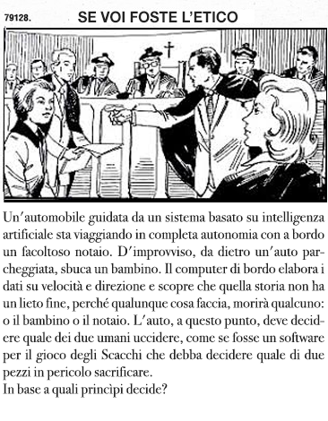

# README

*C'hi++* è una metafisica priva, o quasi, di elementi metafisici; una *theologia naturalis* per coloro che non riescono ad accettare per fede le affermazioni o le contraddizioni delle religioni canoniche, ma allo stesso tempo trovano insoddisfacente una visione siero/positivistica dell'esistenza.  

Un beneficio collaterale di questa metafisica è che può costituire una base “vendor independent” per la definizione di valori e principii etici che permettano alle macchine basate su Intelligenza Artificiale di risolvere problemi come questo:  

Il nome *C'hi++* è un gioco di parole fra il termine giapponese *C'hi* (ovvero: soffio vitale) e il linguaggio di programmazione chiamato: *C++*. Non è un accostamento casuale: la mia intenzione è quella di gestire l'evoluzione della mia teoria così come si gestisce il software; in particolare, il software *open-source*.

Le principali caratteristiche del C'hi++ sono:

- __è un'etica [RISC](http://www.treccani.it/enciclopedia/risc/)__, con un numero ristretto di dogmi;

- **è _open-source_** perché ciascuno possa modificarla per adattarla alle sue esigenze. 

- **è _portabile_**: molti precetti del *C'hi++* sono compatibili con precetti o idee appartenenti ad altre mistiche o filosofie;

- **è sottoposta a versionamento**, così come avviene con il software, per poter gestire l'evoluzione della dottrina;

- **non si propone come Unica Verità Incontestabile**, ma come un'approssimazione sicuramente incompleta e perfettibile della verità;

- **ha una sua cosmogonia**, del tutto indipendente dalla presenza o dall'assenza di una Divinità.

C'hi++ ha anche un suo testo 

