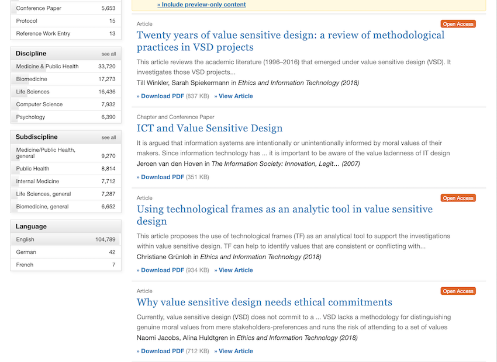
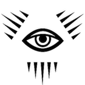

<link rel="stylesheet" type="text/css" href="./css/chi++.css" />

<section class="readme pagina cover">
<header>
    <h1>C'hi++</h1>
    <h2>README.md</h2>
<header>

    
<label>Autore  </label>Carlo Simonelli

    
<label>Versione</label>0.3.0

    
<label>Data    </label>10 Gennaio 2020

<section class="citazione">
What does it mean to implement digital and AI ethics? Beyond what is legal or not – and therefore what you must comply with – you need to determine what you stand for as an organization – what are your brand values? These values should exist whether you use AI or not. You can then define your ethical AI code on the basis of what you stand for.
- Nicolas Economou
</section>  

## Un'etica *vendor-independent* per l'intelligenza artificiale
Abbiamo bisogno di un'etica.  
Ne abbiamo bisogno noi e ne ha bisogno il nostro software.
Il problema è che *etica*, così come *amore* e *arte*, è un termine che tutti utilizzano ma che ciascuno può (legittimamente) interpretare a suo modo.
Di fatto, l'etica è una disciplina filosofica, ma per estensione è anche l'oggetto di studio di quella disciplina: uno schema ordinato di valori e di regole che permettono di determinare cosa sia più o meno giusto fare.
Un esempio di questi insiemi ordinati di valori è la trinità fascista: 

> Dio, Patria, Famiglia

Un esempio delle regole che se ne possono derivare sono:

> Credere, Obbedire, Combattere

In altre parole, comprensibili anche agli adoratori del dio Ferragnez, l'etica è il *dress-code* delle nostre vite e come tutti i *dress-code*, ha valore solo in determinate condizioni. 
Ciò che è eticamente accettabile in alcuni casi (p.es. uccidere un avversario perché indossa una *divisa di un altro colore*, in guerra) può non esserlo in altri (p.es. uccidere un avversario perché indossa una divisa di un altro colore, durante una partita di calcio).
Inoltre, sia i valori che costituiscono un'etica sia il loro eventuale ordinamento sono soggettivi: non esiste alcuna prova né dell'esistenza di un Dio né del fatto che sia più importante di Patria e Famiglia; ci devi credere, e ci credi perché qualcosa o qualcuno ti ha convinto a farlo.
Se consideriamo la notevole disparità di vedute e convinzioni dei Popoli della Terra e, talvolta, degli stessi individui all'interno di un Popolo, è facile capire come la frase: 

> AI interactions that consumers and citizens perceive as ethical build trust and satisfaction[^capgemini]

sia ambigua perché ciò che è *percepito* come etico da qualcuno potrebbe non esserlo per altri.
La conseguenza di questa indeterminatezza è che, come dimostrano questi due articoli su [Springer](rd.springer.com), da vent'anni si sta lavorando a del software “sensibile ai valori”, ma ancora non si è riuscito a decidere *quali* debbano essere questi valori.  

Quindi, abbiamo solo due possibilità: o scriviamo del codice specializzato per ciascun tipo di etica o definiamo un'etica che sia condivisibile dalla maggior parte degli utenti; una sorta di *dress-code* che sia valido sia a una cena di gala che a un toga party. 
Dato poi che è sbagliato ricercare i valori e le motivazioni della propria etica all'interno dello schema stesso, negando ogni forma di trascendenza[^spiego], definiremo una metafisica cui fare riferimento, sfruttando le idee che nacquero e si svilupparono nella culla della Civiltà, ovvero gli anni '80.

Buona parte del software, da adesso in poi, avrà due interfacce utente: una, grafica, dedicata all'interazione con il sistema sensoriale e una metafisica, dedicata all'interazione con la coscienza[^coscienza]. 
Per definire un'etica che sia acccettabile dal maggior numero di persone possibile, dobbiamo fare ciò che fecero i creatori delle prime interfacce grafiche: creare una libreria di simboli il cui significato sia chiaro e condiviso da tutti gli utenti.
In sostanza, abbiamo bisogno di icone.  
Il sostantivo inglese *file* può tradursi con: documento, ملف (Arabo), 文件 (Cinese), файл (Russo), ファイル (Giapponese), 파일 (Coreano) oppure, più semplicemente, può essere rappresentato con il simbolo: 

Così come la pipa di Magritte, il documento del simbolo non è un documento, ma questo non ha importanza perché ciò che conta, qui, è il significato, non il significante.
Quando l'utente di un sistema di scrittura vede il simbolo *File*, non pensa né che quel documento *sia* quello che vuole scrivere lui né che *non sia* il documento che vuole scrivere lui.
È questo l'atteggiamento che dobbiamo stimolare nei fruitori della nostra etica.
Per riuscirci, dobbiamo operare come i poeti o i disegnatori di fumetti, eliminando dai nostri simboli tutto ciò che è superfluo e lasciando solo ciò che serve a denotare l'oggetto a cui si riferiscono.

NO

NO

SI

Anche se complesso, tutto questo è possibile: spogliate degli orpelli voluti dal Clero e ricondotte alle loro caratteristiche essenziali, le diverse ipotesi metafisiche hanno molti punti in comune perché sono tutte, in una maniera o nell'altra, la risposta a uno stesso bisogno: la ricerca di una giustificazione alla nostra esistenza.
Ma, così come avvenne a Linus Torvaldsen, dopo qualche anno che lavoravo a questo progetto, capii che non era un compito che potevo svogere da solo, così cominciai a scrivere un *Manifesto* per spiegare a dei potenziali collaboratori quali fossero le mie intenzioni. 
Preso atto della mia incapacità di produrre un documento accademico, ho redatto il Manifesto come se fosse un progetto informatico, con un *Executive Summary* e un' *Analisi del sistema attualmente in esercizio* nel quale descrivo il problema che mi propongo di affrontare ed esamino le possibili soluzioni.
Quando l'ho proposto al direttore di PC Magazine, mi ha risposto: *Va bene, ma devi scrivere un testo introduttivo di 5.000 battute*.  
Le ho già superate, perciò, mi fermo qui.

## Note

[^neruda]: L'originale è: *Quiero hacer contigo lo que la primavera hace con los cerezos*.

[^capgemini]: Rapporto Capgemini: *Why addressing ethical questions in AI will benefit organizations*.

[^spiego]: Spiego perché a pagina 2 del Manifesto.

[^coscienza]: Inteso qui come: *coscienza di sè*.

