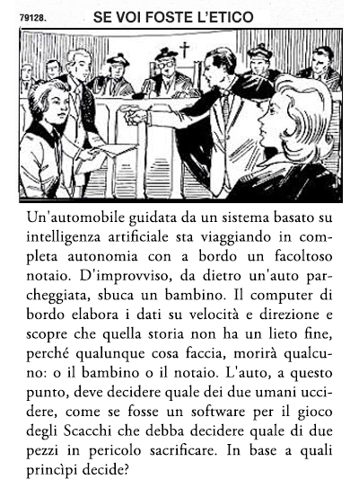

# C'hi++

**[Read the manual on chiplusplus.org →](https://chiplusplus.org/en/)**

*C'hi++* is an excellent programming manual, a clumsy philosophy book, and a disgraceful physics book.  

The purpose of this manual is to define a metaphysics that is free, or almost, of metaphysical elements; a *theologia naturalis* for those who can't bring themselves to accept on faith the claims or contradictions of canonical religions, but who at the same time find a view of existence stripped of spiritual elements unsatisfying.

The name *C'hi++* is a play on words between the Japanese term *C'hi* (氣, meaning: *vital breath*) and the programming language called: *C++*. 
It isn't a casual pairing: my intention is to manage the evolution of my theory the same way software is managed; *open-source* software, in particular.
For this reason, all the material for the book is published on GitHub.

A side benefit of this metaphysics is that it can serve as a "vendor independent" basis for defining the ethical values and principles that would let AI-based machines solve problems like this one:

## Features

The main features of C'hi++ are:

- __it's a [RISC](http://www.treccani.it/enciclopedia/risc/) ethics__, with a restricted number of dogmas;

- **it's _open-source_**, so that anyone can modify it to suit their own needs.

- **it's portable**: the precepts of *C'hi++* are compatible with precepts or ideas belonging to other mystical traditions or philosophies;

- **it's subject to versioning**, the same way software is, so that the evolution of its principles can be managed;

- **it does not present itself as the One Undisputed Truth**, but as an approximation of the truth that is certainly incomplete and open to improvement;

- **it has its own cosmogony**, entirely independent of the presence or absence of a Divinity.

## Directory structure
The project's files are organized into the following directories:

| Name         | Content
|:-------------|:---------------------------------------------------------------------------|
| **_atti**    | Documents for promoting the book
| **_data**    | Standard Jekyll directory. Contains the yml files included in the text.
| **_drafts**  | Standard Jekyll directory. Contains drafts of posts and texts.
| **_includes**| Standard Jekyll include directory.
| **_layouts** | Directory for Jekyll layouts.
| **_man**     | Markdown-format texts of the Manual.
| **_note**    | Notes extracted from Kindle e-books, VUE mind map.
| **_pdf**     | Cache-management or Git-versioning scripts.
| **_posts**   | Notes on drafting the manual and texts on specific topics.
| **_sass**    | Directory for Jekyll's stylesheets.
| **assets**   | Directory for Jekyll's static content.
| **bin**      | Cache-management or Git-versioning scripts.
| **docs**     | Output directory for the Manual.
| **src**      | .cpp and .sql files for the Manual's examples

The [CHANGELOG](CHANGELOG.md) and VERSION files are used for version control with Git.

The README.md file is the one you're reading, and contains a short description of the project's purposes and features.

## Tools
All the file formats used are public standards that can be created and read with free tools:

- **Markdown** for the source texts;
- **PDF** for output files such as articles or essays;
- **C++** for the code;

The only exception is the mind map for *C'hi++*, which I've kept as documentation and which was created with the [VUE](https://vue.tufts.edu/) program from Tufts University.
It is, in any case, an XML-format file, easily readable even in Git *diffs*. 
Unfortunately, development of VUE has been stalled since June 20, 2017, but the code is still [available on GitHub](https://github.com/VUE/VUE).

## Typographical conventions
This section describes the typographical conventions used in the Italian text of the manual &mdash; apostrophe usage, ellipsis length, accented pronouns, and plural forms of words ending in "io" &mdash; and therefore does not apply to the English translation.
