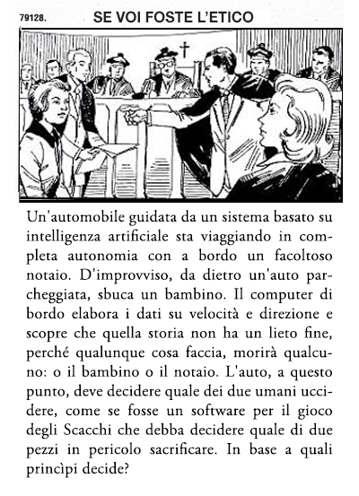

<section class="cover" style="margin-bottom:3rem;text-align:center">
<header>
	<h1>C'hi++ - Il senso della Vita è il *debug*</h1>
	<h2>Presentazione</h2>
<header>
</section>

<

## In breve

*C'hi++* è un eccellente manuale di programmazione, un maldestro libro di filosofia e un vergognoso libro di fisica.  
La forma narrativa è quella del dialogo: all'interno di un monastero, un vecchio maestro insegna a un giovane discepolo i principii della programmazione in C++ e parallelamente lo inizia ai misteri del *C'hi++*: una bizzarra metafisica *open-source*, definita anni addietro dal fondatore del loro Ordine: il mitologico Maestro Canaro che, secondo la leggenda, alla fine del XX° Secolo fu incaricato da Dio di riscrivere in C++ l'applicazione COBOL che fa funzionare l'Universo.  
Il primo e l'ultimo capitolo - il *Prologo* e l'*Epilogo* - sono narrati in prima persona dall'allievo; in tutti gli altri capitoli la voce narrante è quella del Maestro. 

In ogni capitolo, il Maestro affronta uno degli aspetti della programmazione: operatori, funzioni, classi, polimorfismo e perfino il versionamento e la correzione del codice.
Ciascuno di questi argomenti, descritto in dettaglio nella parte iniziale del capitolo, viene poi utilizzato per introdurre i principii del C'hi++ e della sua cosmogonia: lo *Spazionismo*.

Il *C'hi++* è un'etica *open-source* perché ciascuno, se ritene di farlo, la possa modificare senza per questo generare degli scismi.
In quanto tale, ha un suo *repository* su GitHub[^git], che contiene anche i testi preliminari che hanno condotto alla stesura del manuale.  
Dato che i principii di base del *C'hi++* sono compatibili con le principali religioni canoniche, dal Mazdeismo in poi, con un po' di buona volontà, lo si potrebbe utilizzare come base per un'etica *vendor-independent* per l'Intelligenza Artificiale.

## Prodromi
Io c'ero, a Via della Conciliazione, il 28 Febbraio 2020,  
Avevo una clavicola rotta e c'era il rischio del contagio, ma non volevo mancare. 
Non avevo fatto in tempo a farmi fare un accredito dal giornale per cui lavoravo, quindi ero piuttosto lontano dal palco, seduto a fianco a una suora che pubblicava immagini dell'evento su almeno due piattaforme *social*.  
Mi ricordo piuttosto bene di lei, che andava su e giù per il palco, poco prima dell'inizio; non so a cosa stesse pensando, in quel momento; io - forse ingenuamente - avevo l'impressione di assistere a un evento sorico, una versione *full-HD* di Nicea o di Trento.
Ricordavo ancora come, nel Novembre del 2015, all'indomani degli attacchi *jihadisti*, alcuni commentatori avessero ostentato il loro laicismo, come se il solo fatto di avere una fede rendesse complici di quelle morti[^laici]. 
Era bello vedere, cinque anni dopo, come i fatti dimostrassero il loro errore e come la Chiesa, senza rinnegare i proprii principii - e, anzi, proprio in virtù di essi - riuscisse a indirizzare la “bleeding-edge” della tencologia prima e meglio di quanto riuscissero a fare gli Stati laici.  

## Il vergognoso libro di fisica

Estate 2005; avevo appena finito di leggere un saggio su tempo ed eternità e cercai di immaginare cosa ci fosse ai limiti dell'Universo, oltre l'orbita dell'ultimo satellite dell'ultimo pianeta dell'ultima stella dell'ultima galassia. 
Per riuscire a gestire con la mia mente finita una grandezza infinita come quella dello spazio, ideai un artificio lessicale: immaginai che lo spazio, come tale, fosse costituito da elementi infinitesimali, dotati di “esistenza potenziale”.
In pratica, così come i *pixel* di uno schermo a raggi catodici sono spenti a meno che non siano colpiti dal fascio di elettroni del pennello elettronico, cosi gli *spazioni*[^spazioni] del mio modello esistevano solo se venivano irraggiati di energia, altrimenti erano nulla.   
Era un'idea troppo stupida per non elaborarla ulteriormente, così, introdussi nella mia cosmogonia un'idea che Poe aveva descritto nel suo saggio *Eureka*, ovvero che l'Universo sia generato dalla contrapposizione di due forze opposte: la Gravità, ovvero la tendenza di tutto ciò che esiste a tornare all'Uno primigenio; e l'Elettricità, che al contrario, tende a dividere; cambiai solo il nome della forza separatrice in *Entropia*, che rendeva meglio l'idea.  
Nel mio immaginario collettivo, quindi, la vita dell'Universo veniva ad assumere un andamento ciclico in tre fasi: 

1. all'inizio di ciascun ciclo, l'energia è concentrata in solo punto, tenuta insieme dalla Gravità; 
2. l'Entropia causa la digregazione dell'Uno, scagliandone l'energia nello spazio, irraggiandone gli spazioni e generando l'universo così come lo conosciamo;
3. l'universo si espande fino a quando la Gravità ha la meglio sull'Entropia e tutta la materia/energia torna a contrarsi nell'Uno.

Purtroppo, anche se questa visione delle cose rispondeva al requisito di dare una spiegazione dell’esistenza sfruttando solo ciò di cui abbiamo un'esperienza diretta, aveva un problema: era socialmente inappetibile.
Infatti, anche assumendo che il ripetersi infinito dei cicli di *Big-Bang* e *Big-Crunch* potesse portare, statisticamente[^infinito], alla ripetizione di alcune linee temporali e quindi alle nostre esistenze, queste non avrebbero avuto alcuna relazione le une con le altre perché ogni memoria delle nostre scelte e delle nostre azioni sarebbe stata annichilita al termine di ciascuna fase di contrazione.
Stando così le cose, perché avremmo dovuto comportarci "bene" (nel senso che davano a questo termine i nostri nonni)? 
Annichiliti per annichiliti, tanto valeva godersi la vita finché possibile, freganosene delle conseguenze che avrebbero potuto avere le nostre azioni sugli altri esseri viventi. 

## Il maldestro libro di filosofia

Ho deciso di scrivere *C'hi++* per mettere ordine nello *gnommero* di idee prodotto in me da anni di studio *eclettico e confuso* (come direbbe Rodari).
Ho scelto di inserire le mie teorie in un manuale di programmazione perché pensavo che questo - essendo la programmazione e la metafisica due modi di descrivere realtà diverse da quelle che percepiamo con i sensi - avrebbe reso più facile la spiegazione di alcuni concetti[^ssl].  
Così come il linguaggio `C++` è una evoluzione del linguaggio chiamato `C`, a cui aggiunge le funzioni proprie della programmazione a oggetti, il *C'hi++* è un'evoluzione dello Spazionismo, a cui aggiunge un elemento metafisico chiamato *I Post-It*[^post-it], ovvero una memoria persistente dell'Universo che mantiene traccia dell’esito delle scelte fatte in ciascun ciclo di espansione e contrazione.
L'introdouzione di questo elemento rende *stateful* le diverse permutazioni *stateless* dello Spazionismo e permette di ipotizzare, in linea con il sotto-titolo del libro, che l'esistenza sia una continua ricerca della perfezione.
Grazie ai *Post-It*, infatti, gli esseri senzienti possono ricordare ciò che è successo nei precedenti cicli di esistenza e, in base a questa conoscenza, possono ripetere scelte che si sono dimostrate positive o modificare quelle che hanno dato esiti fallimentari[^goedel].   

## Conclusioni
 
Ho chiuso la prima revisione del testo il 5 Febbraio 2023, ma non ho ancora inviato *C'hi++* a nessun editore perché ero convinto che un libro così non avesse un pubblico.
Trent'anni fa non mi sarei fatto un simile scrupolo, perché la maggior parte degli informatici combinava competenze tecniche con interessi umanistici, ma oggi le cose sono drasticamente cambiate: legge libri solo il 40% degli Italiani sopra i sei anni e, di questi, quasi la metà non va oltre i tre libri l'anno. 
Che mercato si può pensare che abbia, un libro di programmazione che parla anche del senso della vita?  
Il buon successo che ha avuto il Congresso Mondiale di Filosofia di Roma[^ceo], però, mi ha spinto a valutare la via della pubblicazione.
Sto quindi rivedendo il testo, limando quello che mi era sfuggito durante il primo giro di bozze, poi lo invierò ad alcuni editori italiani. 
Il passo successivo sarà di tradurre il testo in Inglese e di tentare la pubblicazione su mercati esteri.   
Mi farebbe piacere se lei potesse darmi un suo parere su questo lavoro.  
Il repository Git è qui:
 
    https://github.com/TacunIT/chi-plus-plus

Il testo del libro lo trova all'indirizzo:

    https://chiplusplus.org/man/

Se vuole saltare la parte relativa alla programmazione, faccia click sul titolo di ciascun capitolo.
I  capitoli che illustrano le idee di base del libro sono 

    https://chiplusplus.org/man/istruzioni-condizionali#dottrina
    https://chiplusplus.org/man/istruzioni-iterative#dottrina

Qui invece c'è il testo di un racconto intitolato *L'Universo in C++* che scrissi alla fine degli anni '90 e che utilizzo come antefatto della storia.

    https://chiplusplus.org/man/mitopoietica

Grazie per aver letto fin qui, spero di non averla annoiata.  
 
 
Carlo Simonelli  
 
 
Roma, Gennaio 2025. 
 
 
  

[^git]: https://github.com/TacunIT/chi-plus-plus

[^laici]: https://canaro.net/saggi/bergoglio-e-pregiudizio.html.

[^spazioni]: Chiamai così i miei quanti di spazio e *Spazionismo* la mia teoria, per riderne con mia moglie quando glielo avrei raccontato. 

[^infinito]: Come ammette anche Richard Dawkins: *Dato un tempo infinito o un numero di opportunità infinite, è possibile qualsiasi cosa*.
  
[^ssl]: Per esempio, la questione della giustificazione di un giudizio morale in base a una teoria preesistente, di cui ho letto sul vostro libro nei giorni scorsi, è assimilabile all'emissione dei certificati SSL da parte delle *Certification Authority*.  https://chiplusplus.org/man/operatori#dottrina

[^post-it]: Ma sto pensando di rinomniarlo *I Cookies*, che è più appropriato.

[^goedel]: Ho sempre pensato che questo sia l'equivalente per il *C'hi++* del *Teorema di Incompletezza* di Goedel, perché potrebbe permettere la giustificazione della Shoah in base al presupposto che i nazisti hanno sterminato gli Ebrei perché, in altre linee temporali, uno di loro aveva causato danni all'Umanità. Sto cercando un modo per evitarlo, ma a oggi non so come.

[^ceo]: Oltre al fatto che uno dei relatori principali fosse anche il CEO di una delle nostre maggiori aziende informatiche.  

