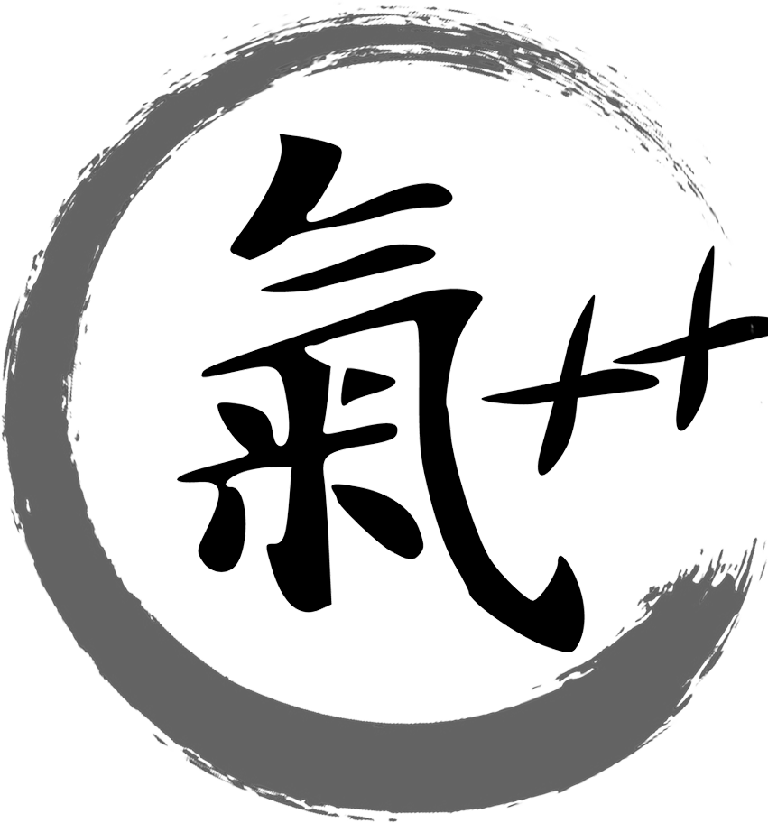

# C'hi++ - Il senso della vita è il *debug*
## Presentazione

<blockquote class="citazione">
Come molti scienziati, ho casse piene di lettere e cartelle piene di mail di persone che mi scrivono con idee scientifiche nuove, le più originali e le più ardite.   
Non servono a nulla.  
</blockquote>

## Grazie

Io le devo un favore, anzi: due; uno esistenziale (diciamo così) e uno editoriale.  
Il favore esistenziale a che fare con un'architetto tedesca di nome Eva, perciò comincio da quello.  
Ero in auto e stavo tornando a casa a Gaeta.
Erano forse le tre di notte e la Pontina era vuota, a parte i camion.
Circa un'ora prima, sdraiato sul divano della teutonica, dove mi ero auto-esiliato dopo una discussione, avevo dovuto prendere atto che la nostra storia non poteva andare avanti, il che mi rendeva molto triste perché non solo lei era alta, bionda e con gli occhi azzurri, ma anche perché mi raccontava delle storie incredibili sulla Berlino *pre-89*, tipo che in uno stesso negozio una volta trovavi le fragole, un'altra volta i chiodi, a seconda di quello che era disponibile, o che quando era nata lei, i suoi genitori avevano chiesto un'auto allo Stato e lo Stato gliel'aveva concessa, ma tempo che l'auto arriva era nato suo fratello e allora avevano dovuto chiedere un'auto diversa, che non gli era mai stata consegnata perché nel frattempo era caduto il Comunismo[^barze]..  
Insomma ero piuttosto triste e mi tenevo sveglio cambiando compulsivamente le stazioni della radio.
Fu così che approdai a una sua intervista, non ricordo su quale rete RAI.
Lei parlava delle sue ricerche e io, di colpo, dimenticai tutti i miei dolori da (non più) giovane Werther, perché ciò di cui lei parlava somigliava molto a qualcosa su cui stavo ragionando da tempo..  
Il favore editoriale, di contro, è stato di rivelarmi il mio peccato di *hỳbris*.
Eh già: perché sulla teoria cosmogonica che avevo iniziato a elaborare nel 2005, io ci stavo scrivendo un libro e, fino a quel momento, (il Cielo mi perdoni) ero convinto di aver avuto un'intuizione geniale che avrebbe rivoluzionato il nostro modo di vedere l'Universo e la vita.
Io, che da anni criticavo la cialtronaggine e il dilettantismo, mi stavo trsasformando in un tuttologo da TV locale. 
Come dice il poeta (Califano):

> Me vergognai parecchio  
> E cominciai a fa' i conti co' lo specchio

Paradossalmente, però, quell'epifania rese tutto più semplice: abbandonata la speranza di vincere **insieme** il Nobel per la Letteratura e per la Fisica, la stesura del libro divenne di colpo più facile e, grazie anche all'isolamento dovuto alla pandemia, tre anni più tardi terminavo la prima stesura di *C'hi++ - Il senso della Vita è il debug*, un libro indubbiamente anomalo, ma non intellettualmente peccaminoso.

## Il libro 

Come ho scritto nella prefazione del libro, *C'hi++* è un eccellente manuale di programmazione, un maldestro libro di filosofia e un vergognoso libro di fisica.  
La forma narrativa è quella del dialogo: all'interno di un monastero, un vecchio maestro insegna a un giovane discepolo la programmazione in C++ e ne utilizza i principii (tipi di dato, classi, struttura dei programmi ecc.) per per iniziarlo ai misteri del *C'hi++*, una bizzarra metafisica definita anni addietro dal fondatore del loro Ordine: il mitologico Maestro Canaro che, secondo la leggenda, alla fine del XX° Secolo era stato incaricato da Dio di riscrivere l'applicazione COBOL che fa funzionare l'Universo.

Non proverò a dettagliare ulteriormente il contenuto del testo per non correre il rischio di venir scambiato per l'ennesimo terrapiattista rettiliano che propone al mondo una verità pseudo-scientifica ignota a tutti fuorché a lui[^intevista]. 
Ciò che conta è che i principii espressi in *C'hi++* sono la *proof-of-concept* di un'ipotesi che avevo formulato nel 2018, ovvero l'applicazione alle attività filosofico/speculative dei metodi con cui si gestisce il software cosiddetto *open-source*.  
In particolare, nel testo evidenziavo dei problemi congeniti a tutte le religioni e sostenevo che questi problemi si sarebbero potuti mitigare con le seguenti accortezze:

- limitare il numero dei dogmi;
- limitare gli elementi metafisici e le accettazioni per fede;
- non proporsi come Unica Verità Incontestabile, ma come un'approssimazione sicuramente incompleta e perfettibile della Verità;
- riconoscere le contraddizioni della dottrina e analizzarle obiettivamente, anche se ciò porterà a modificare la dottrina stessa.

Tanto i sostenitori che i seguaci di un simle Credo sarebbero stati quindi incentivati a modificarne le regole per renderlo sempre più aderente alla realtà ultima, in un processo di miglioramento continuo tanto della disciplina che dei suoi adepti[^ebrei].  
Ma come dice il poeta (sempre Califano):

> Queste so' idee, 
> Ma tocca realizzalle.

Se volevo *trovare gli argomenti che mostrino che esse «sono migliori» di quelle correnti*, dovevo provare a metterle in pratica, cosa che ho fatto con il *C'hi++*, che presenta tutte le caratteristiche riportate sopra:

- **ha un solo dogma:** ai fedeli viene chiesto C'hi++ è richiesto di credere che ci sarà un momento in cui l’espansione dell’Universo terminerà e che tutto ciò che esiste tornerà a collassare su sé stesso per poi dare vita a un nuovo *Big Bang*;

- **ha un solo elemento metafisico:** una memoria persistente dell'Universo che mantiene traccia dell'esito delle scelte fatte in ciascun ciclo; qualcosa di simile all'inconscio collettivo di Jung o ai *vāsanā* dell'Induismo:

- **si considera esplicitamente un'approssimazione sicuramente incompleta e perfettibile della Verità:** non a caso tutti i documenti relativi al *C'hi++*, compresa questa lettera, sono pubblicati si un *repository* GitHub, una delle piattaforme utilizzate per la gestione del software *open-source*.

La cosa affascinante di questa dottrina è che risulta compatibile con la maggior parte delle religioni canoniche, dal Mazdeismo in poi[^polimorfismo], il che la renderebbe un ottimo punto di partenza per la definizione di un ethos condiviso per l'Intelligenza artificiale.   
*C'hi++* è compatibile anche con alcune affermazioni che ho trovato nel suo libro su Anassimandro:

- **propone un sistema di spiegazione dei fatti del mondo in termini delle cose del mondo:** la cosmogonia del *C'hi++* è intenzionalmente priva di elementi metafisici ed è del tutto indipendente dalla presenza o dall'assenza di una Divinità. 

- è **un’intera immagine del mondo nuova e coerente:** il *C'hi++* permette di dare una risposta coerente e logica a domande come: *Se Dio è buono, perché ha creato il Male?*; 

## Nella cassa

Concludo con una domanda che non ha nulla a che vedere con il resto di questo messaggio: l'esempio del figlio che invia notizie al padre, che lei fa in "Buchi bianchi" è ispirato al racconto: "I sette cavalieri" di Buzzati?  

[^barze]: Reagan raccontava una barzelletta simile:  https://www.youtube.com/watch?v=_wxAA-Wm-og

[^intevista]: È un rischio reale: ho scritto almeno quattro presentazioni diverse e, rileggendole, tutte mi davano la stessa impressione. Per evitare ciò, ho deciso di utilizzare come introduzione al testo una mia finta intervista in una radio privata di terz'ordine, nella quale spiego sia il contenuto che la genesi del libro, dando all'intervistatore il compito di sottolinearne in maniera ironica o sarcastica le evidenti anomalie:  https://chiplusplus.org/2025/06/21/intervista-radio-coscialunga.html

[^ebrei]: Non è nulla di nuovo: oltre agli scienziati, anche gli Ebrei lo fanno da sempre e ,guarda caso, pur essendo circa il 2 per mille della popolazione mondiale, hanno vinto il 20% dei premii Nobel degli ultimi centoventi anni. 

[^polimorfismo]: Ne parlo nel capitolo dedicato al polimorfismo:  https://chiplusplus.org/man/polimorfismo#dottrina

