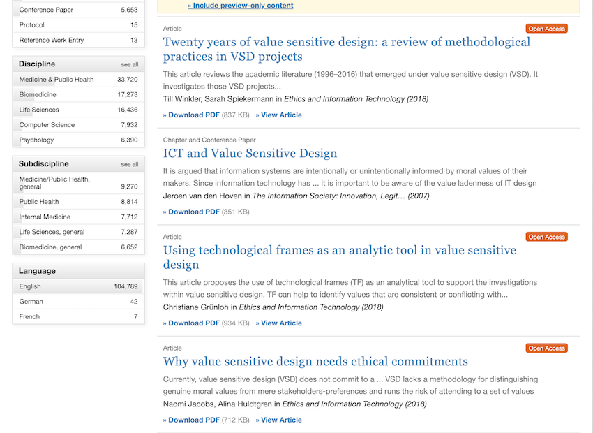

# C'hi++ - Un'etica *vendor-independent* per l'intellgenza arificiale

> *You need to determine what you stand for as an organization – what are your brand values? These values should exist whether you use AI or not. You can then define your ethical AI code on the basis of what you stand for.* -
Nicolas Economou

Il 28 Febbraio, Brad Smith, presidente di Microsoft e John Kelly III, vice direttore esecutivo di IBM, firmeranno la ***Rome Call for AI Ethics***, un documento di intenti per lo studio e la regolamentazione dell'Intelligenza Artificiale.
La firma avverrà nell'ambito dell'incontro dal titolo: [*RenAIssance  A Human-centric Artificial Intelligence*](http://www.academyforlife.va/content/pav/it/notizie/2020/intelligenza-artificiale-2020.html), organizzato dalla Pontificia Accademia per la Vita, al quale parteciperanno anche il presidente del Parlamento Europeo David Sassoli e il direttore generale della Fao Qu Dongyu.
Non è la prima volta che si cerca di definire un'etica dell'Intelligenza Artificiale.
Il problema è che *etica*, così come *amore* e *arte*, è un termine che tutti utilizzano ma che ciascuno può (legittimamente) interpretare a suo modo.

Di fatto, l'etica è una disciplina filosofica, ma per estensione è anche l'oggetto di studio di quella disciplina: uno schema di valori e di regole che permettono di decidere cosa sia più o meno giusto fare.
In altre parole, comprensibili anche agli adoratori del dio Ferragnez, l'etica è il *dress-code* delle nostre vite e come tutti i *dress-code*, **una determinata etica ha valore solo in determinate condizioni**.
Ciò che è eticamente accettabile in alcuni casi - per esempio uccidere un avversario perché indossa una *divisa di un altro colore*, in guerra -, può non esserlo in altri - per esempio, uccidere un avversario perché indossa una divisa di un altro colore, durante una partita di calcio.  Il primo Articolo della *Déclaration des Droits de l’Homme et du Citoyen* del 1798, afferma che:

> Les hommes naissent et demeurent libres et égaux en droits. Les distinctions sociales ne peuvent être fondées que sur l’utilité commune.

Questa affermazione è sicuramente condivisibile, ma non ha prove a conforto e non è valida per chiunque viva in una delle 43 nazioni del Mondo dove vige una monarchia: ovvero una su cinque.

Inoltre, **i valori che costituiscono un'etica sono soggettivi**.
Questo vale sia per le etiche di natura religiosa che per quelle di natura non religiosa.
Per esempio, la *Declaration of Independence* del 1776 comincia con queste parole:

> We hold these truths to be self-evident, that all men are created equal, that they are endowed by their Creator with certain unalienable Rights, that among these are Life, Liberty and the pursuit of Happiness.

Definire un principio: *self-evident* equivale a dichiarare un dogma: una convinzione che appartiene a chi scrive, ma non si applica necessariamente a tutti gli esseri viventi. La trinità:

> Liberté, Égalité, Fraternité

è dogmatica così come:

> Dio, Patria, Famiglia

Nulla prova che questi valori siano reali o corretti, ci devi credere; e ci credi perché qualcosa o qualcuno ti ha convinto a farlo.
Se consideriamo la notevole disparità di vedute e convinzioni dei Popoli della Terra e, talvolta, degli stessi individui all'interno di un Popolo, è facile capire come la frase:

> AI interactions that consumers and citizens perceive as ethical build trust and satisfaction[^capgemini]

sia ambigua perché ciò che è *percepito* come etico da qualcuno potrebbe non esserlo per altri.
Calvino sostiene che il successo negli affari è una prova del favore divino, San Francesco predica la povertà; chi ha ragione?

La conseguenza di questa indeterminatezza è che, come dimostrano questi due articoli su [Springer](https://rd.springer.com), da vent'anni si sta lavorando a del software “sensibile ai valori”, ma ancora non si è riuscito a decidere *quali* debbano essere questi valori.

Stando così le cose, abbiamo solo due possibilità: o scriviamo del codice specializzato per ciascun tipo di etica o **definiamo un'etica che sia condivisibile dalla maggior parte degli utenti**; una sorta di *dress-code* che sia valido sia a una cena di gala che a un toga party.
Dato poi che è sbagliato ricercare le motivazioni della propria etica all'interno dello schema stesso, negando ogni forma di trascendenza, definiremo una metafisica cui fare riferimento, sfruttando le idee che nacquero e si svilupparono nella culla della Civiltà, ovvero gli anni '80.

Per definire un'etica che sia acccettabile dal maggior numero di persone possibile, dobbiamo fare ciò che fecero i creatori delle prime interfacce grafiche: creare una libreria di simboli il cui significato sia chiaro e condiviso da tutti gli utenti.
In sostanza, **abbiamo bisogno di icone**.
Il sostantivo inglese *file* può tradursi con: documento, ملف (Arabo), 文件 (Cinese), файл (Russo), ファイル (Giapponese), 파일 (Coreano) oppure, più semplicemente, può essere rappresentato con il simbolo:

Così come la pipa di Magritte, il documento del simbolo non è un documento, ma questo non ha importanza perché ciò che conta, qui, è il significato, non il significante.
Quando l'utente di un sistema di scrittura vede il simbolo *File*, non pensa né che quel documento *sia* quello che vuole scrivere lui né che *non sia* il documento che vuole scrivere lui.
È questo l'atteggiamento che dobbiamo stimolare nei fruitori della nostra etica.
Per riuscirci, dobbiamo operare come i poeti o i disegnatori di fumetti, eliminando dai nostri simboli tutto ciò che è superfluo e lasciando solo ciò che serve a denotare l'oggetto a cui si riferiscono.

Pur se complesso, tutto questo è possibile. Spogliate degli orpelli voluti dal Clero e ricondotte alle loro caratteristiche essenziali, le diverse ipotesi metafisiche hanno molti punti in comune perché sono tutte, in una maniera o nell'altra, la risposta a uno stesso bisogno: la ricerca di una giustificazione alla nostra esistenza.
Posso dirlo con buona certezza, perché da più di dieci anni sto lavorando a un libro dal titolo: **C'hi++ - Il senso della vita è il debug**, nel quale intendo definire i principî della mia etica *vendor-independent*, corredandola di una metafisica del tutto indipendente dall’esistenza di una o più Divinità.

Ma così come avvenne a Linus Torvaldsen con Linux, dopo qualche anno che lavoravo a questo progetto mi resi conto che questo era un compito che non potevo svogere da solo.
Perciò misi tutti i miei documenti su GitHub[^github] e cominciai a scrivere un *Manifesto* per spiegare a dei potenziali collaboratori quali fossero le mie intenzioni.
Preso atto della mia incapacità di produrre un documento accademico, ho redatto il testo come se fosse un progetto informatico, con un *Executive Summary* e un' *Analisi del sistema attualmente in esercizio* nel quale descrivo il problema che mi propongo di affrontare, esaminando le possibili soluzioni. Ne è derivato un documento di quarantasei pagine: dettagliato, ma decisamente troppo lungo per poter fungere da manifesto del progetto.
L'ho trasformato perciò in un documento a sé stante e ho cercato di condensare le principali informazioni che conteneva nel file README che compare all'apertura del progetto su GitHub e nel MANIFEST, da cui è tratta buona parte di questo articolo.

Se volete saperne qualcosa di più, C'hi++ è qui:
[https://chiplusplus.org] (https://chiplusplus.org) 

Se volete collaborare o anche esporre delle critiche, potere farlo con gli strumenti canonici di [GitHub] (https://github.com).

## Note

[^neruda]: L'originale è: *Quiero hacer contigo lo que la primavera hace con los cerezos*.

[^capgemini]: Rapporto Capgemini: *Why addressing ethical questions in AI will benefit organizations*. [https://www.sogeti.com/explore/reports/why-addressing-ethical-questions-in-ai-will-benefit-organizations](https://www.sogeti.com/explore/reports/why-addressing-ethical-questions-in-ai-will-benefit-organizations)

[^github]: La piattaforma con cui si gestisce la maggior parte del software *open-source*.
