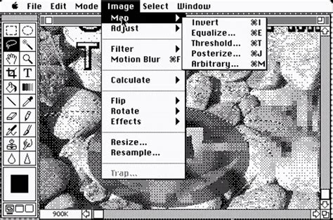

<section class="citazione pagina">

{{ site.data.citazioni.asimov }}

 

{{ site.data.citazioni.mulino-amleto.mulo }}

</section>

<b>C'hi++</b> è un tentativo di spiegare il significato dell'Esistenza nei termini dell'informatica.
Questa miscela di spiritualità e tecnologia è presente sia nel nome *C'hi++* &mdash; che è un gioco di parole fra il termine giapponese *C'hi* e il linguaggio di programmazione chiamato *C++* &mdash;, sia nel modo in cui verrà gestita l'evoluzione della disciplina: lo stesso che viene utilizzato per il software *open-source*.
I precetti del C'hi++ sono illustrati in un libro dal titolo:
[*C'hi++ - Il senso della vita è il debug*](/man/)
e sono riassunti nel testo:
[*C'hi++ - Proposta per una metafisica open-source*](/proposta.html).
Tutti i testi, le immagini e i dati relativi al C'hi++ sono raccolti in un
<a  title="Va' al progetto su GitHub"
    target="github"
    href="{{ site.url_github }}">
    repository su GitHub</a>; se volete altre informazioni su questo progetto, potete trovarle lì, nei file:
<a href="https://github.com/TacunIT/chi-plus-plus" target="github">README</a> e
<a href="https://github.com/TacunIT/chi-plus-plus/blob/master/MANIFEST.md" target="github">MANIFEST</a>.

---

Tutto nasce da una domanda: *È possibile dare una spiegazione dell'esistenza sfruttando solo ciò di cui abbiamo esperienza diretta?*
Le religioni, per “funzionare”, richiedono da una a tre dimensioni aggiuntive, oltre quelle note; la Scienza, per le sue *superstringhe* ha bisogno almeno di sette dimensioni aggiuntive, ovvero il doppio di quelle che servono per un Aldilà non spirituale. Esiste una spiegazione più semplice?
Dopo averci ragionato su per una quarantina di anni, posso dire che sì: una spiegazione più semplice esiste ed è anche compatibile con molti dei principii delle religioni canoniche, alle quali C'hi++ non vuole sostituirsi, ma affiancarsi.

C'hi++ non è né scienza né religione, anche se ogni tanto finge di essere o l'una o l'altra.
C'hi++ è mito e la mitologia ha spesso mescolato il soprannaturale con il livello più alto dello sviluppo scientifico o tecnologico.
Anticamente, abbiamo attribuito una controparte divina al lampo che generava il fuoco, al moto degli astri, alla meteorologia.
Più recentemente, Poe, in *Eureka*, ha ipotizzato che l'Universo sia il frutto dell'azione contrapposta della Gravità, che lui interpreta come la tendenza di tutta la materia a tornare all'Uno primigenio e dell'Elettricità, che al contrario, tende a dividere.
All'inizio del Secolo scorso, infine, i Futuristi hanno mitizzato i simboli del progresso tecnologico &mdash; velocità, eliche, aeroplani, automobili &mdash;, rendendoli l'oggetto della loro arte.
<!-- @todo: aggiungere nota sulla scienza -->
Nulla di strano, quindi, che all'inizio di questo millennio si tenti un paragone fra le regole note del software e le regole ignote dell'Universo in cui viviamo.

C'hi++ non si propone come una spiegazione assoluta e definitiva del Significato dell'Esistenza, ma come un modello incompleto e perfettibile.
È per questo motivo che ha una versione, come il software: perché possa evolvere col tempo, così come avviene per il software.
Questa è la prima versione del programma Photoshop, nel 1990:

e questo è Photoshop oggi, trent'anni dopo:

Così come i modelli matematici usati per la meteorologia non rendono tutta la complessità dei movimenti delle masse d'aria dell'atmosfera, ma forniscono comunque delle previsioni attendibili, così il C'hi++ non fornisce una descrizione completa e accurata di ciò che è, è stato e sarà, ma può fornire una risposta non dogmatica ad alcune domande riguardanti la nostra vita.

---

I principii del C'hi++ si basano su una cosmogonia che riprende alcune idee di Poe, come il contrasto fra contrazione ed espansione, a cui aggiunge un maggior livello di dettaglio, definendo gli ipotetici elementi che costituiscono l'Universo ovvero, gli: *spazioni*, da cui il nome: *Spazionismo* (lo so che non è un nome serio, ma quando ho cominciato a formulare questa teoria non avrei mai immaginato di renderla pubblica e comunque è sempre bene non prendersi troppo sul serio).

Per lo Spazionismo, l'Universo è costituito da elementi infinitesimali dotati di “esistenza potenziale”.
Così come lo schermo di un computer è costituito da una matrice bidimensionale di pixel, generalmente spenti, ma capaci di accendersi se colpiti da un raggio di luce, così l'Universo è costituito da una matrice tridimensionale di spazioni, capaci di acquisire massa e quindi esistere  se ricevono energia.
La vita dell'Universo è vista come un ciclo continuo:

<b>Fase 1.</b> L'universo è vuoto, tutta l'energia è concentrata in un'unico punto, tenuta insieme dalla Gravità.

<b>Fase 2.</b> L'Entropia (ovvero una Forza che causa separazione) sopraffà la Gravità e causa l'esplosione dell'Uno.
L'energia comincia a espandersi nell'Universo, irradiando gli spazioni che quindi assumono massa ed esistenza, generando le stelle e i pianeti così come li conosciamo.

<b>Fase 3.</b> Quando la spinta data dall'Entropia diminuisce, la Gravità inverte il moto dell'energia/materia; l'Universo si contrae tornando a concentrarsi nell'Uno.
Quando tutta l'energia dell'Universo è di nuovo concentrata nell'Uno, il ciclo ricomincia.

Spazioni a parte, questa ipotesi non è poi così irrealistica; l'unico atto di fede che viene richiesto a chi legge riguarda il fatto che l'Universo tornerà *sicuramente* a collassare su sé stesso.
Di questo, a oggi, non c'è prova scientifica, ma nella *Bhagavad-Gita* si afferma qualcosa di piuttosto simile:

> {{ site.data.citazioni.gita.caos }}

Una volta che l’Universo collassato esploderà nuovamente, i casi possibili saranno due:

<b>Caso 1.</b> Potrebbe essere che un *Big Bang* avvenga solo in determinate condizioni e che quelle condizioni portino necessariamente a un Universo identico a quello come noi lo conosciamo adesso; quindi, se l’Uno esploderà di nuovo, ricomincerà tutto da capo.  
<!-- todo: aggiungere nota su processo 68 -->

<b>Caso 2.</b> Se ogni *Big Bang* avviene in circostanze e con modalità specifiche, quando l'Uno esploderà di nuovo, nascerà un nuovo Universo, che potrà avere pochi o nessun punto di contatto con quello corrente.

La prima ipotesi è possibile, ma poco probabile, quindi diamo per scontato che quella corretta sia la seconda.
Per quanto bassa possa essere la probabilità che si verifichino due esplosioni uguali, in un lasso di tempo infinito non possiamo escludere che questo Universo tornerà a manifestarsi e che anche ciò che c’è in esso possa tornare a essere, noi compresi.  

> {{ site.data.citazioni.gita.cicli }}

Ma chi siamo, “noi”? Se la materia altro non è che la manifestazione di una unica Energia, ha poco senso distinguerci gli uni dagli altri; dovremmo ragionare invece come il poeta iraniano Saadi di Shiraz:

> {{ site.data.citazioni.saadi }}

Però, se davvero siamo tutti degli epifenomeni, il nostro io cosciente può manifestarsi ora qui ora lì, a seconda dei casi.
E se io, in questo ciclo dell’Universo, mi metto a spacciare droga fregandomene delle persone che ammazzo, in un altro ciclo di questa particolare specie di Universo potrei ritrovarmi in uno di quei drogati subendo le conseguenze delle mie stesse azioni. È quindi preferibile che io mi comporti bene e che cerchi di convincere anche gli altri a comportarsi bene, perché, come recita il *Mantiq al-Tayr*:

> {{ site.data.citazioni.mantiq.male }}

Il problema, come sempre, è capire *cosa* sia davvero “bene”.
Per farlo, abbiamo bisogno di introdurre l'unico elemento realmente metafisico del C'hi++: una sorta di memoria persistente dell'Universo, simile all'*hard-disk* dei computer o al *Vāsanā* di Yoga e Buddhismo, nella quale rimane traccia delle scelte che abbiamo fatto durante le nostre esistenze e delle conseguenze che hanno generato.
Se capiamo che una nostra azione ha avuto delle conseguenze negative, quell'azione verrà “memorizzata” fra gli errori, nella speranza che non venga ripetuta in altre occasioni.
Al contrario, le azioni che hanno degli esiti positivi verranno “ricordate” come buone, affinché le si ripeta in altri cicli di vita dell'Universo.

Per il C'hi++, ciascun essere senziente è uno dei neuroni di un cervello (l'Universo) a cui contribuisce a dare forma grazie a ciò che impara nel corso delle sue esistenze.
Se riconosciamo i nostri errori come tali, è possibile che non li ripeteremo in futuro; altrimenti continueremo a commetterli, generando delle forme “dolorose” dell'Universo.
Per questo motivo, secondo il C'hi++, “*il senso della Vita è il debug*”, perché solo analizzando e correggendo i nostri errori, così come si fa con il software, potremo migliorare la “forma” dell'Universo e, di conseguenza, le nostre esistenze.

In altre parole, il Paradiso e l'Inferno non sono altrove: sono solo due stati possibili dell'Universo e siamo noi, con le nostre azioni e le nostre intenzioni, a decidere in quale dei due vogliamo vivere.
