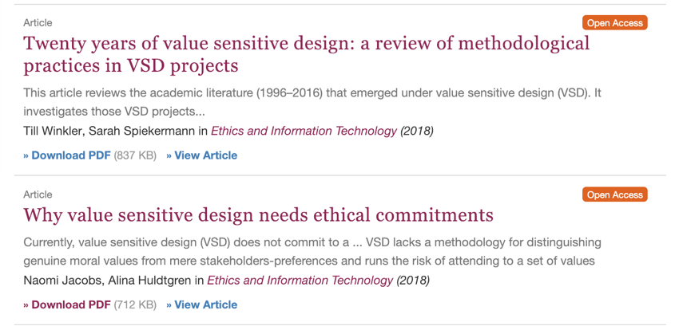

<section class="pagina cover">
<header>
    <h1>C'hi++</h1>
    <h2>Un'etica *vendor-independent* per l'intelligenza artificiale</h2>
<header>

    
<label>Autore  </label>Carlo Simonelli

    
<label>Versione</label>0.1.0

    
<label>Data    </label>5 Gennaio 2020

<section class="citazione">
What does it mean to implement digital and AI ethics? Beyond what is legal or not – and therefore what you must comply with – you need to determine what you stand for as an organization – what are your brand values? These values should exist whether you use AI or not. You can then define your ethical AI code on the basis of what you stand for.
- Nicolas Economou
</section>  

## Il *dress-code* delle nostre vite 
Posso riassumere il senso di questo articolo parafrasando una frase di Neruda:

> Quiero hacer con la ética lo que Linus hizo con Unix[^neruda]

Abbiamo bisogno di un'etica.  
Ne abbiamo bisogno noi e ne ha bisogno il nostro software.
Il problema è che *etica*, così come *amore* e *arte*, è un termine che tutti utilizzano ma che ciascuno può (legittimamente) interpretare a suo modo.  
Di fatto, l'etica è una disciplina filosofica, ma per estensione è anche l'oggetto di studio di quella disciplina: uno schema ordinato di valori e di regole che permettono di determinare cosa sia più o meno giusto fare.  
Un esempio di questi insiemi ordinati di valori è la trinità fascista: 

1. Dio 
2. Patria
3. Famiglia

Le regole che ne derivano sono:

1. Credere
2. Obbedire
3. Combattere

In altre parole, comprensibili anche agli adoratori del dio *Ferragnez*, l'etica è il *dress-code* delle nostre vite e come tutti i *dress-code*, ha valore solo in determinate condizioni. 
Ciò che è eticamente accettabile in alcuni casi (p.es. uccidere un avversario perché indossa una *divisa di un altro colore*, in guerra) può non esserlo in altri (p.es. uccidere un avversario perché indossa una divisa di un altro colore durante una partita di calcio).  
Inoltre, sia i valori che costituiscono un'etica sia il loro eventuale ordinamento sono soggettivi: non esiste alcuna prova né dell'esistenza di un Dio né del fatto che sia più importante di Patria e Famiglia; ci devi credere, e ci credi perché qualcosa o qualcuno ti ha convinto a farlo.
Se consideriamo la notevole disparità di vedute e convinzioni dei popoli della Terra e, talvolta, degli stessi individui all'interno di uno stesso popolo, è facile capire come la frase: 

> AI interactions that consumers and citizens perceive as ethical build trust and satisfaction[^capgemini]

sia ambigua perché ciò che è (percepito come) etico da qualcuno potrebbe, legittimamente, non esserlo per altri.  
La conseguenza di questa indeterminatezza è che, come dimostrano questi due articoli su [Springer](rd.springer.com), da vent'anni si sta lavorando a del software “sensibile ai valori”, ma ancora non si è riuscito a decidere *quali* debbano essere questi valori.  

Per risolvere questo problema abbiamo solo due possibilità: o scriviamo del codice specializzato per ciascun tipo di etica o definiamo un'etica che sia condivisibile dalla maggior parte degli utenti. 
E dato che è sbagliato e limitativo ricercare i valori e le motivazioni della propria etica all'interno dello schema stesso, negando ogni forma di trascendenza[^spiego], dovremo anche definire una metafisica, anche questa *vendor-independent*, cui fare riferimento.
 
Ma come è possibile definire un *dress-code* che sia valido sia a una cena di gala che a un toga party?
Non è facile, ma è possibile e, per riuscirci, dobbiamo fare riferimento alle idee che nacquero e si svilupparono nella culla della Civiltà, ovvero gli anni '80.

## Informistici
Buona parte del software, da adesso in poi, avrà due interfacce utente: una, grafica, dedicata all'interazione con il sistema sensoriale e una metafisica, dedicata all'interazione con la coscienza[^coscienza]. 

Per definire un'etica che sia acccettabile dal maggior numero di persone possibile, dobbiamo fare ciò che fecero i creatori delle prime interfacce grafiche: creare una libreria di simboli il cui significato sia chiaro e condiviso da tutti gli utenti.  
In sostanza, abbiamo bisogno di icone.    

Il sostantivo inglese *file* può tradursi con: documento, ملف (Arabo), 文件 (Cinese), файл (Russo), ファイル (Giapponese), 파일 (Coreano) oppure, più semplicemente, può essere rappresentato con il simbolo: 

Così come la pipa di Magritte, il documento del simbolo non è un documento, ma questo non ha importanza perché ciò che conta, qui, è il significato, non il significante.  
Quando l'utente di un sistema di scrittura vede il simbolo *File*, non pensa né che quel documento sia quello che vuole scrivere lui né che non sia il documento che vuole scrivere lui.   
È precisamente questo, l'atteggiamento che dobbiamo stimolare nei fruitori della nostra etica.
Per riuscirci, dobbiamo operare come i poeti o i disegnatori di fumetti, eliminando dai nostri simboli tutto ciò che è superfluo e lasciando solo ciò che serve a denotare l'oggetto a cui si riferiscono.

Contrariamente a ciò che sembra, è una missione possibile, ma 

<!--
e così come l'AI ha creato la nuova figura professionale di *data scientist*, è possbile che a breve vedremo offerte di lavoro per informistici. 
-->

## Note

[^neruda]: L'originale è: *Quiero hacer contigo lo que la primavera hace con los cerezos*

[^capgemini]: Rapporto Capgemini *Why addressing ethical questions in AI will benefit organizations*.

[^coscienza]: Inteso qui come: *coscienza di sè*.

[^spiego]: Spiego perché a pagina 2 del Manifesto, non voglio auto-spoilerarmi..
